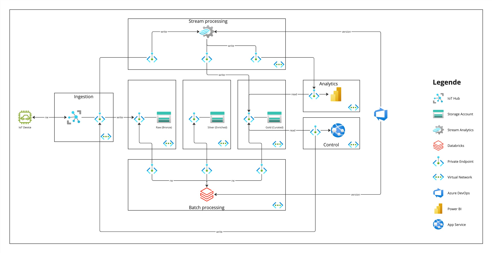

# Assignment: Cloud Platorm Engineer

## Focus on Platform / Infrastructure

### Architecture
_Design an architecture that allows us to collect, process and analyze data from our taxi operation as well as send data back to individual cars_:

Designed was an architecture with three instances of storage that is layered into raw, enriched and curated. The data will be gathered through an IoT Hub sending the raw data into the first data layer (raw) but also to Stream Analytics for stream processing. This stream processing writes near-realtime data to third (curated) layer and streaming capable tools like Power BI. In addition Databricks will run scheduled batch processing jobs cleaning/filtering/augmenting the raw data into the second (enriched) layer and ready-to-consumption data into third (curated) layer. Applications like Power BI or other services can consume both near-realtime and batch data and create a merged view. App Services can use the data and send data back to the IoT device via the Hub.



### Automation
_Develop a script to automate the setup and maintenance of your architecture. It’s ok if it’s only parts of it or 2-3 components and not the whole architecture. We should be able to rollout the components but also update the whole or individual parts_:

Terraform was chosen for this task. Terraform lets you create new resources as well as update the existing ones by checking stored states. 
Developed was a pipeline template for Azure DevOps. The pipeline is a .yaml file containing terraform script. The pipeline only contains: 
- 1 IoT Hub
- 1 Storage Account
- 1 Databricks
- 1 Stream Analytics Cluster (40min creation time)

The pipeline requires a storage account allowing to save terraform states in it. Variables to set for the pipelines are:
- tf-resourcegroup: 
  Resource group where the resources are located, needed by terraform.
- tf-storage-account: 
  Storage account which terraform is allowed to operate on. 
- tf-storage-account-key:
  Storage account key to authorize terraform.
- service_connection
  Service principal which terraform can use to create and destroy azure resources.

##### Pipeline
```
pipelines/dataplatform-build.yaml
```

### Data Exfiltration and Infiltration
_Think about how to secure the data we are collecting for this use case and the platorm in general. What tools and approaches can be used to minimize the risk of unwanted Data Exfiltration or Data Infiltration_:

As a first step towards more security in general the access to the platform (or resources) should be made private so there is no public access except the necessary traffic from the IoT devices. The resources can be separated into different virtual networks allowing communication only via private endpoints between the services. This enables allowing/blocking ip ranges.  

Furthermore, the approach of least privilege should be followed. Creating service principals that are assigned to only those actions, which the different services need to operate.

Using services that provide security features. E.g. Azure IoT-Hub which provides "Per-device identity" to enable verification per device. 


### Vision
_Create a vision for the future of our taxi company data platform, what are going to be important pillars and elements that we should focus on in the next 2-3 years_:

With more customers accessing data from that platform, it is important to have something like role-based-access-control on the data. It should be supervised who is authorized to read/write what data. Thus, in case of manipulation or data loss we can track who had access and the authority to do so. 

A common problem when working with data scientists are requests for data. While security rules follow the least privilege approach, data scientists often want to explore what data  exists and what data can be used. Therefore, building something like an data catalogue for customers could be an important feature and would speed up the process of handling data requests. 

Another important step could be the tracking of data flows and further the truth of the data. Serving thousands of use cases, it's necessary to be able to see where the data comes from and what data should be used for these use cases. This would also counteract the duplication of data keeping the platform clean and efficient.

With machine learning and artificial intelligence gaining more and more importance it could be also a next step to prepare for those use cases. As an example, a feature store is essential for machine learning. There is also a need for versioned data. As a consequence, integrating these technologies to the data platform could be crucial, making it an important pillar.
